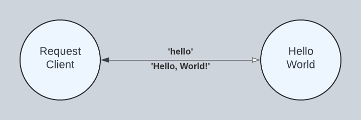
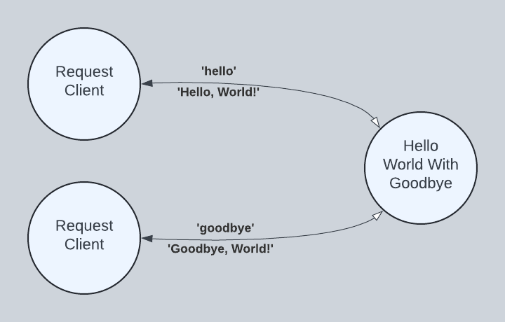

# Hello, World!

In this section, we learn how to create and run simple Torq programs.

## `HelloWorld`

The fundamental unit of concurrency in Torq is the actor. In our diagram below, `RequestClient` and `HelloWorld` are actors that run concurrently with the potential to run in parallel. `RequestClient` sends a `'hello'` message to `HelloWorld`, and in response, `HelloWorld` sends a `'Hello, World!'` message to `RequestClient`. Note the sold line arrow. The labels are read clockwise, so that we say `'hello'` is sent from `RequestClient` to `HelloWorld` and `'Hello, World!'` is sent from `HelloWorld` to `RequestClient`. The open arrow points toward the recipient of the request and the closed arrow points toward the recipient of the response, the terminus of our interaction.



### Programming `HelloWorld`

`HelloWorld` is defined beginning with the `actor` keyword. Following the actor keyword is the name `HelloWorld`. An actor can accept parameters that affect how it is configured. In our case, there are no parameters. Next, the actor requires that a body be defined between enclosing `in` and `end` keywords. The `HelloWorld` actor contains just one statement in its body, an ask handler, specified as `handle ask 'hello' in ... end`.

~~~
actor HelloWorld() in
    handle ask 'hello' in
        'Hello, World!'
    end
end
~~~

Our ask handler is programmed to receive `'hello'` messages one at a time. If additional `'hello'` messages are received while one is being processed, they are queued until `HelloWorld` is ready to receive another. Like our actor, our ask handler requires that a body be defined between enclosing `in` and `end` keywords. Our ask handler contains a single expression in its body, the `'Hello, World!`' string literal. By convention, an ask handler returns the last expression as its result.

### Running `HelloWorld`

Torq is a dynamic language run on the JVM. In this section, we place our source into a Java `String` literal. With our source code in hand, we build and execute our program from Java using a fluent builder tool.

~~~java
public static final String SOURCE = """
    actor HelloWorld() in
        handle ask 'hello' in
            'Hello, World!'
        end
    end""";

public static void perform() throws Exception {

    // Build and spawn HelloWorld. After spawning, HelloWorld is waiting to
    // receive the 'hello' message. The spawn method returns an actorRef used
    // subsequently to send it messages.
    ActorRef actorRef = Actor.builder()
        .spawn(SOURCE);

    // Send the 'hello' message to the actor reference returned above. Wait a
    // maximum of 100 milliseconds for a response.
    Object response = RequestClient.builder()
        .sendAndAwaitResponse(actorRef, Str.of("hello"), 100, TimeUnit.MILLISECONDS);
    checkExpectedResponse(Str.of("Hello, World!"), response);
}
~~~

> Click [org.torqlang.examples.HelloWorld.java](https://github.com/torq-lang/torq-jv/blob/main/torqlang-examples/src/main/java/org/torqlang/examples/HelloWorld.java) to see the full source code on GitHub.

## `HelloWorldWithGoodbye`

In our `HelloWorldWithGoodbye` diagram, we extend `HelloWorld` with a `'goodbye'` handler. We use two instances of `RequestClient` to send two different requests to just one instance of `HellWorldWithGoodbye`. This demonstrates a long-running actor servicing different requests from multiple clients.



### Programming `HelloWorldWithGoodbye`

```
actor HelloWorld() in
    handle ask 'hello' in
        'Hello, World!'
    end
    handle ask 'goodbye' in
        'Goodbye, World!'
    end
end
```

### Running `HelloWorldWithGoodbye`

```java
public static final String SOURCE = """
    actor HelloWorld() in
        handle ask 'hello' in
            'Hello, World!'
        end
        handle ask 'goodbye' in
            'Goodbye, World!'
        end
    end""";

public static void perform() throws Exception {

    // Build and spawn HelloWorld. After spawning, HelloWorld is waiting to
    // receive the 'hello' or 'goodbye' message. The spawn method returns an
    // actorRef used subsequently to send it messages.
    ActorRef actorRef = Actor.builder()
        .spawn(SOURCE);

    // Send the first message -- 'hello'
    Object response = RequestClient.builder()
        .sendAndAwaitResponse(actorRef, Str.of("hello"), 100, TimeUnit.MILLISECONDS);
    checkExpectedResponse(Str.of("Hello, World!"), response);

    // Send the second message -- 'goodbye'
    response = RequestClient.builder()
        .sendAndAwaitResponse(actorRef, Str.of("goodbye"), 100, TimeUnit.MILLISECONDS);
    checkExpectedResponse(Str.of("Goodbye, World!"), response);
}
```

## Summary

In this section, we learned:

1. How to program concurrent actors
2. How to run an actor program from Java
3. How to use a concurrent actor to service multiple requests