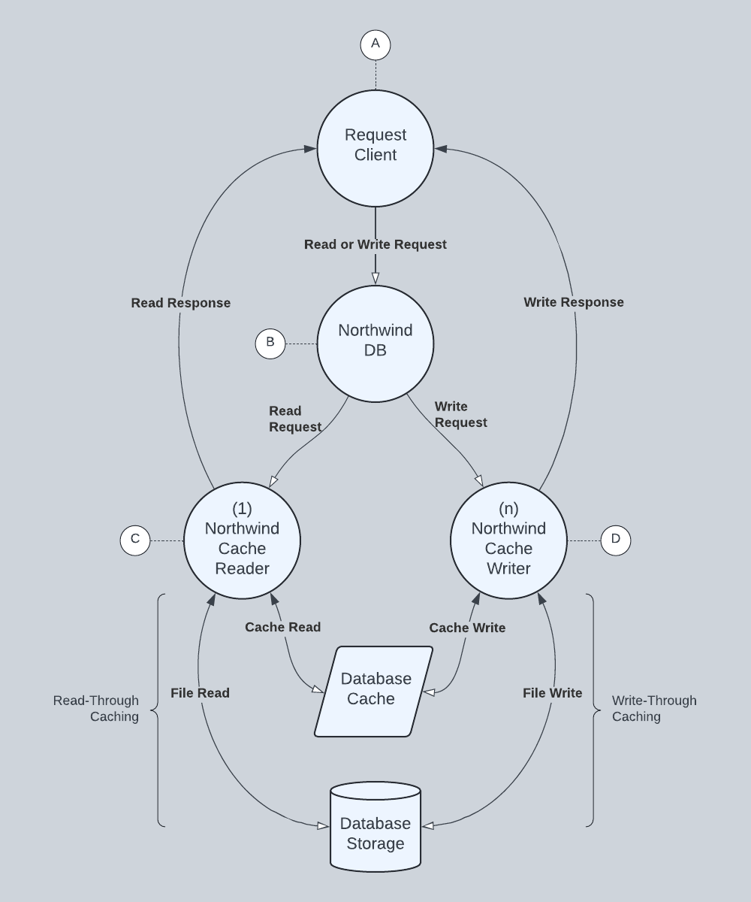

# Northwind Database

In this section, we implement the Northwind database as a through-cache server using a directory as a backing storage. The goal is to create a realistic, self-contained data source that not only serves as an example of using native actors but can also be used in follow-on examples and benchmarking.

## Read-Through Caching

A read-through cache acts as an intermediary between an application and a database. When an application reads from the cache, the cache checks if the data is already in memory. If the data is there, the cache returns it directly to the application. If the data is not in memory, the cache loads it from the database, stores it in memory, and then returns it to the application.

## Write-Through Caching

A write-through cache acts as an intermediary between an application and a database. When an application writes to the cache, the cache writes the data to memory first and then immediately writes that cached data through to the database. Processing suspends until the data is successfully written to the database.

## `NorthwindDB`

The Northwind database uses 4 native actors (A, B, C, and D), 1 shared memory cache (E), and one file system directory (F).

